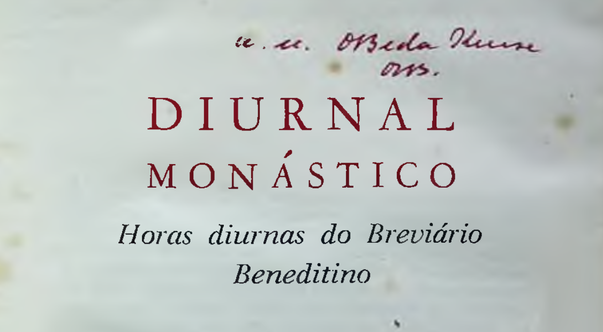

# Diurnal Monástico

latim - português

elaborado por um grupo de monges do Mosteiro de São Bento do Rio de Janeiro
com aprovação eclesiástica

De acordo com o novo Calendário e alguns novos textos aprovados para a Ordem pela Sagrada Congregação dos Ritos a 21-3-1962.

---

# Sobre este repositório

O repositório armazena o resultado de uma iniciativa de digitalização do diurnal em [PDF scaneado](diurnal-monastico-horas-diurnas-do-breviario-monastico.pdf).

Aceito pul requests!

### Procuro partituras!

Se você possui um pdf contendo as partituras dos ritos, por favor entre em contato!

---

# Conteúdos
 
[Apresentacao.md](./Apresentacao.md)

[Calendário Beneditino (no Brasil)]("Calendário Beneditino (no Brasil).md")

